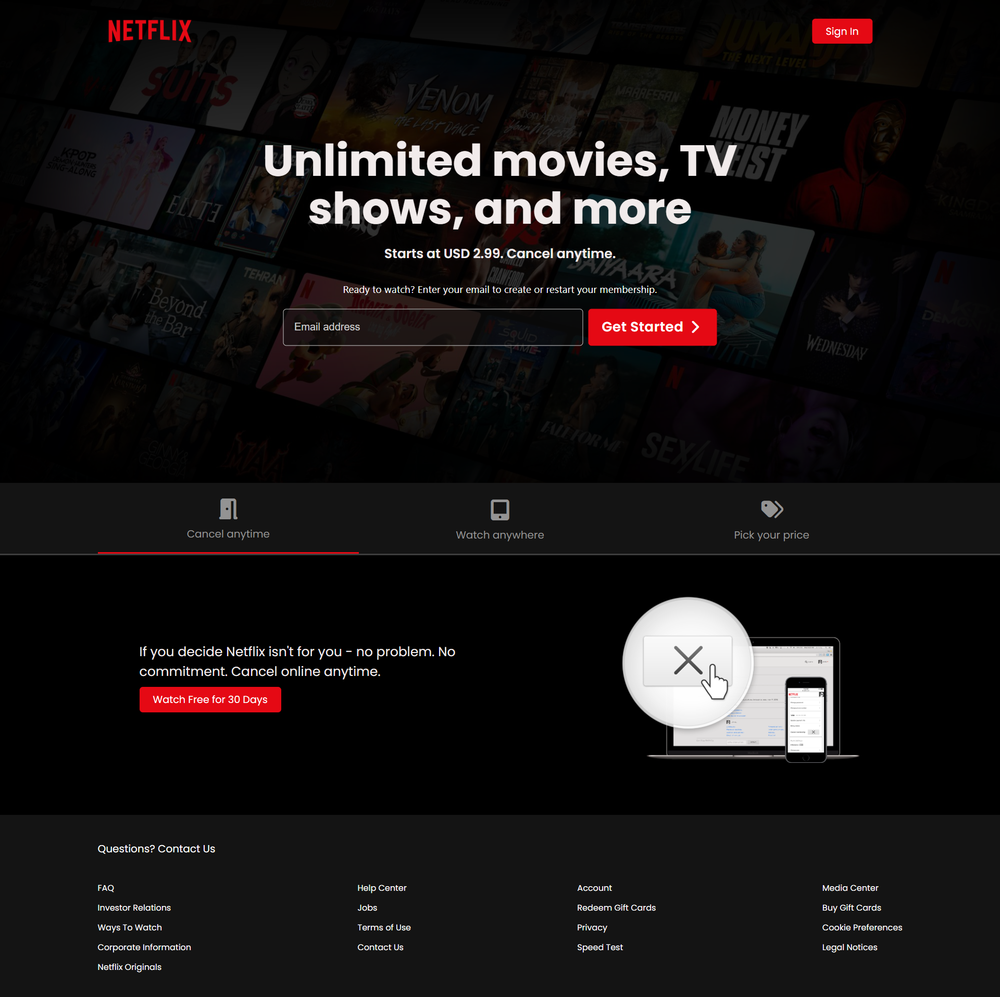
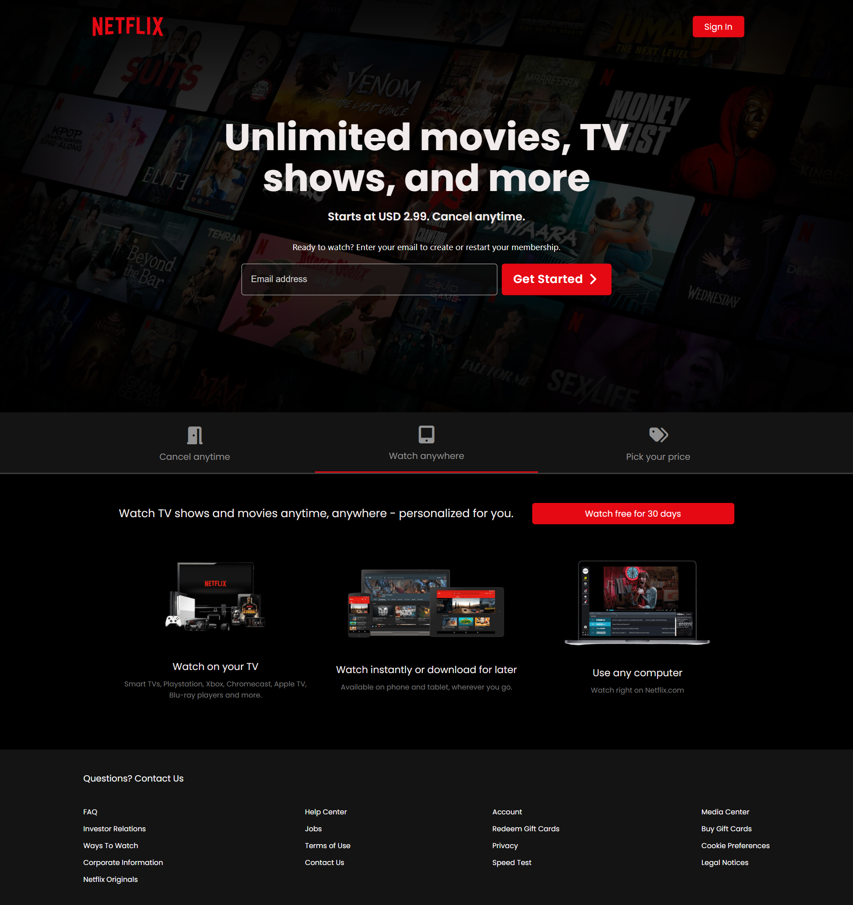
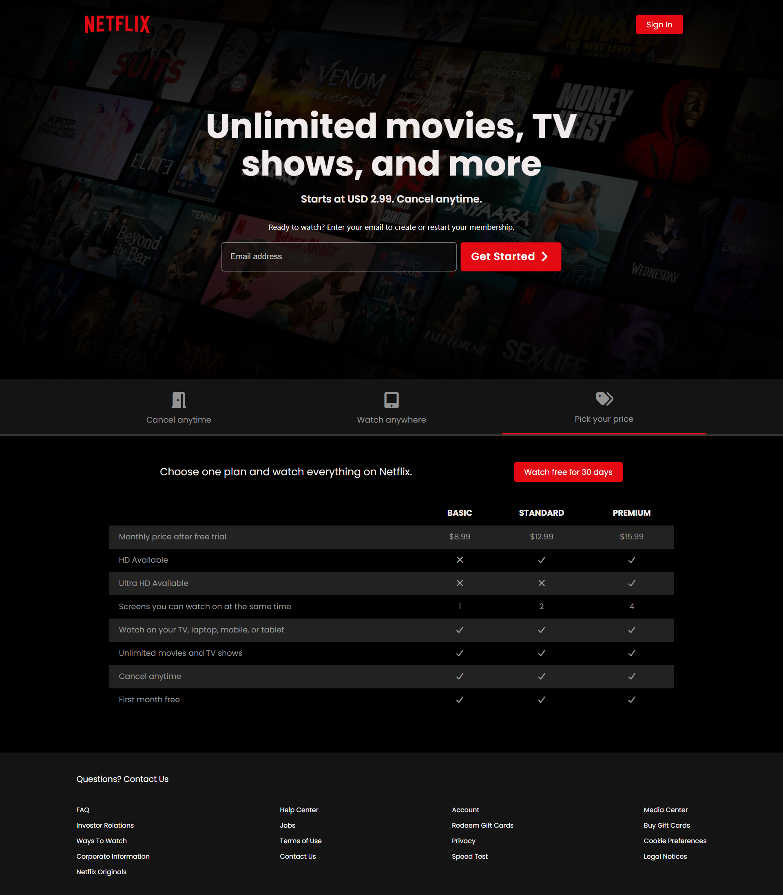

# Netflix Landing Page Clone

A responsive Netflix landing page clone built with HTML, CSS, and vanilla JavaScript. It mirrors Netflix’s hero section, email signup form, interactive tabs, and pricing table.

## Features

- **Hero section** with background image, headline, subtext, and email form (`index.html`, `style.css`).
- **Interactive tabs**: Cancel Anytime, Watch Anywhere, Pick Your Price (`script.js`).
- **Pricing table** with plan comparisons.
- **Responsive design** using CSS Grid/Flex and media queries.
- **CDNs** for Google Fonts and Font Awesome icons.

## Tech Stack

- **HTML5** for structure
- **CSS3** for layout, responsiveness, and styling
- **JavaScript (ES6)** for tab interaction

## Project Structure

```
Netflix Clone/
├── index.html
├── style.css
├── script.js
└── public/
    ├── Netflix_Logo_RGB.png
    ├── bg.jpg
    ├── cancel-anytime.png
    ├── content-1.png
    ├── content-2.png
    └── content-3.png
```

## Getting Started

- **Run locally**: Open `index.html` in any modern browser.
- No build step or server is required.

## How It Works

- **Tabs**
  - Tab triggers: elements with class `tab-item` and ids `tab-1`, `tab-2`, `tab-3` in `index.html`.
  - Tab content containers: `#tab-1-content`, `#tab-2-content`, `#tab-3-content`.
  - `script.js` registers click listeners on `.tab-item`. On click, it:
    - Removes `tab-border` from all tabs and `show` from all content sections (`removeBorder()`, `removeShow()`).
    - Adds `tab-border` to the clicked tab.
    - Shows the matching content by id mapping: `${tab.id}-content`, then adds `show` to display.
- **Styling**
  - Key variables: `--primary-color`, `--dark-color` in `style.css`.
  - Responsive tweaks via media queries at `960px` and `700px` breakpoints.
  - Background overlay and hero layout controlled by `.showcase` and `.showcase::after`.

## Customization Tips

- Replace images under `public/` with your own assets.
- Update copy in `index.html` (hero text, pricing rows, footer links).
- Adjust colors in `:root` within `style.css`.

## Screenshots





## Acknowledgments

- Icons via [Font Awesome CDN](https://cdnjs.com/libraries/font-awesome)
- Fonts via [Google Fonts (Poppins)](https://fonts.google.com/)

## License

This project is for learning and portfolio purposes. No affiliation with Netflix.
